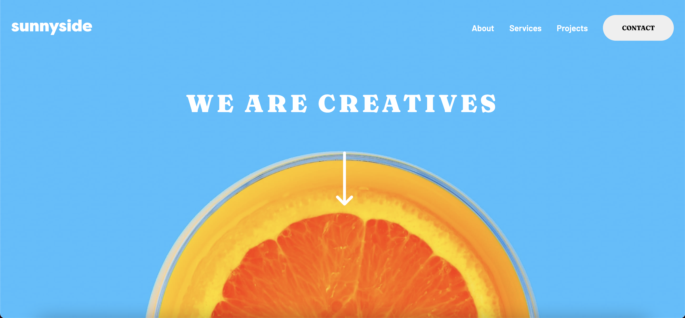

# Frontend Mentor - Sunnyside agency landing page solution

This is a solution to the [Sunnyside agency landing page challenge on Frontend Mentor](https://www.frontendmentor.io/challenges/sunnyside-agency-landing-page-7yVs3B6ef). Frontend Mentor challenges help you improve your coding skills by building realistic projects.

## Table of contents

- [Overview](#overview)
  - [The challenge](#the-challenge)
  - [Screenshot](#screenshot)
  - [Links](#links)
- [My process](#my-process)
  - [Built with](#built-with)
  - [What I learned](#what-i-learned)
  - [Continued development](#continued-development)
- [Author](#author)

## Overview

### The challenge

Users should be able to:

- View the optimal layout for the site depending on their device's screen size
- See hover states for all interactive elements on the page

### Screenshot



### Links

- Solution URL: [Add solution URL here](https://your-solution-url.com)
- Live Site URL: [Add live site URL here](https://anuarshaidenov.github.io/Sunnyside-Agency-Landing-Page/)

## My process

### Built with

- Semantic HTML5 markup
- CSS custom properties
- Flexbox
- CSS Grid
- Mobile-first workflow
- Vanilla JS

### What I learned

This project I decided to go with BEM notation for my class names. It made it so much easier working with Sass later on.

Here's an example of my usecase of BEM:

```html
<ul class="desktop-nav-elements">
  <li class="desktop-nav-elements--element">
    <a href="#" class="desktop-nav-elements--element__link">About</a>
  </li>
  <li class="desktop-nav-elements--element">
    <a href="#" class="desktop-nav-elements--element__link">Services</a>
  </li>
  <li class="desktop-nav-elements--element">
    <a href="#" class="desktop-nav-elements--element__link">Projects</a>
  </li>
  <li class="desktop-nav-elements--element">
    <a href="#" class="desktop-nav-elements--element__link"
      ><button class="btn btn--primary btn--white">Contact</button></a
    >
  </li>
</ul>
```

I also learnt that it is better to use background-image property for static images on pages instead of defining them on html documents. It's helpful when you have images of different qualities for each screen size.

IT IS VERY IMPORTANT TO TAKE BREAKS WHEN YOU'RE STUCK. GET SOME SLEEP DRINK SOME COFFEE DO NOT STRESS TOO MUCH SKILL WILL COME WITH EXPERIENCE.

I once again divided my scss files into 5 parts. It helped.

I learnt how to keep aspect ratio on responsive pages. I used padding:100% for 1:1 aspect ratio. For other ones calc function is needed. That's how I managed to keep aspect ratio for showcase images section.
Now I have a deeper understanding of CSS grid but still need to practice a bit more.

```css
.section-showcase {
  display: grid;
  grid-template-columns: 1fr 1fr;

  &--img {
    background-position: center;
    background-repeat: no-repeat;
    background-size: cover;
    padding-top: 100%;
  }
}
```

And finally I had a bit of refresher working with mobile nav again. Kinda had to look it up to refresh my knowledge on it but it worked out well.

### Continued development

I will definetely use all the techniques in future projects. It was really good refreshing my knowledge with all the methods I've used here. Looking forward for more challenges.

## Author

- Instagram - [@044anuar](https://www.instagram.com/044anuar)
- Frontend Mentor - [@anuarshaidenov](https://www.frontendmentor.io/profile/anuarshaidenov)
- Twitter - [@yourusername](https://www.twitter.com/anuarnyi)
